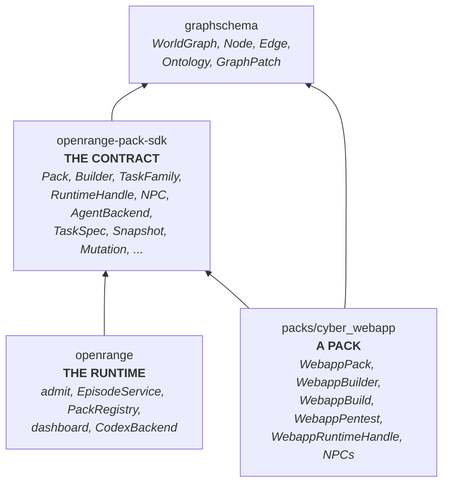
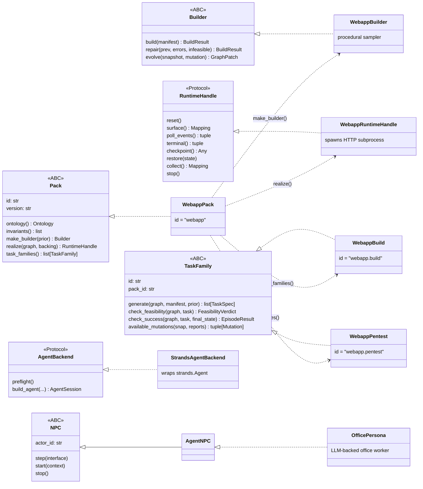
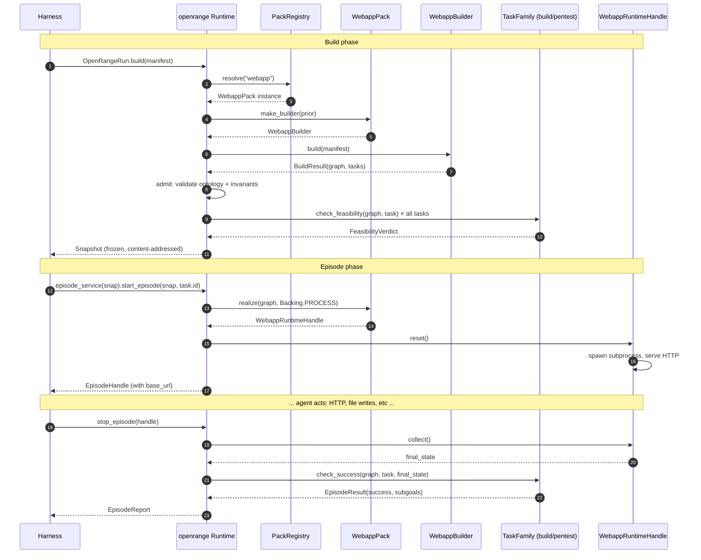

# OpenRange architecture

How the pieces fit together. Three diagrams from zoom-out to zoom-in.

## Package dependencies

Arrow = "depends on". The runtime and the pack each depend on the SDK; **they never import each other**. The boundary `scripts/check_boundary.sh` enforces. A pack can live in its own repo, be versioned independently, and only pin `openrange-pack-sdk` + `graphschema`.

## Type hierarchy

The SDK owns the contracts; concrete cyber_webapp classes implement them.

Solid arrows (`<|--`) are inheritance. Dashed arrows (`<|..`) are Protocol implementation. Open dashed (`..>`) are "produces/uses." The SDK side (top) declares the contract; the cyber_webapp side (bottom) is one implementation. A trading pack would add `TradingPack`, `TradingBuilder`, etc. as siblings.

## Build → Episode flow

The harness only ever talks to `openrange`. Everything pack-specific flows through the SDK's Pack / Builder / TaskFamily / RuntimeHandle methods. The pack's WebappPack / Builder / etc. never call into `openrange` — they're called BY it.

## Plain-English glossary

- **Pack** — a class that defines a *kind of world* (its ontology, how to sample one, how to realize it, which task families it ships). One Pack = one world type; each `build()` against it produces a fresh concrete world.
- **Builder** — the Pack's hand for *producing* concrete world graphs from a manifest. Procedural sampler, LLM pipeline, hand-coded — anything that returns a `BuildResult`.
- **Snapshot** — one concrete admitted world. Frozen, content-addressed (`snapshot_id == graph.content_hash()`).
- **TaskFamily** — a *category of tasks* the agent can be given inside any snapshot of this pack's world type. Different families exercise different agent skills against the same world.
- **RuntimeHandle** — the running realization of a snapshot. The actual process serving HTTP / files / whatever the agent acts against.
- **NPC** — a non-player actor inside the world's runtime, optionally LLM-backed (`AgentNPC`).
- **AgentBackend** — the SDK Protocol any LLM agent loop (Strands, Codex, custom) implements. The harness wires a concrete backend into `RunConfig`; NPCs receive it via context.

## Related docs

- [start_here.md](start_here.md) — overview + vocabulary in prose
- [../CONTRACTS.md](../CONTRACTS.md) — wire shapes and cross-pack invariants
- [../DESIGN.md](../DESIGN.md) — rationale behind the pack / admission split
